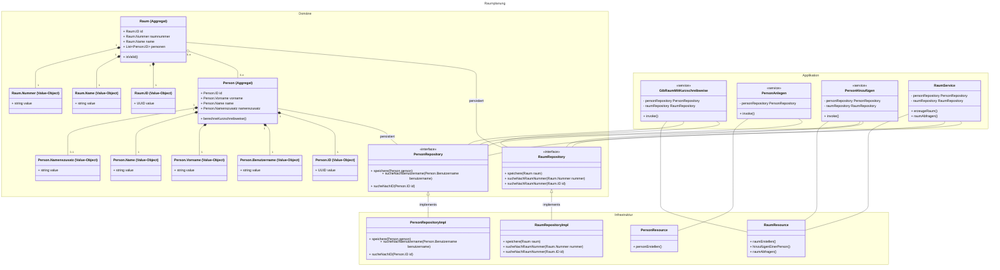

```mermaid
---
title: Raumplanung
---
classDiagram
    namespace Domäne {
        class `Raum (Aggregat)` {
                + Raum.ID id
                + Raum.Nummer raumnummer
                + Raum.Name name
                + List~Person.ID~ personen
                + isValid()
        }
        class `Raum.ID (Value-Object)`{
                + UUID value
        }
        class `Raum.Nummer (Value-Object)`{
                + string value
        }
        class `Raum.Name (Value-Object)`{
                + string value
        }
        class `RaumRepository` {
                + speichere(Raum raum)
                + sucheNachRaumNummer(Raum.Nummer nummer)
                + sucheNachRaumNummer(Raum.ID id)
        }
        class `Person (Aggregat)` {
                + Person.ID id
                + Person.Vorname vorname
                + Person.Name name
                + Person.Namenszusatz namenszusatz
                + berechneKurzschreibweise()
        }
        class `Person.ID (Value-Object)`{
                + UUID value
        }
        class `Person.Benutzername (Value-Object)`{
                + string value
        }
        class `Person.Vorname (Value-Object)`{
                + string value
        }
        class `Person.Name (Value-Object)`{
                + string value
        }
        class `Person.Namenszusatz (Value-Object)`{
                + string value
        }
        class `PersonRepository` {
                + speichere(Person person)
                + sucheNachBenutzername(Person.Benutzername benutzername)
                + sucheNachID(Person.ID id)
        }
    }
    namespace Applikation {
        class GibRaumMitKurzschreibweise {
                - personRepository PersonRepository
                - raumRepository RaumRepository
                + invoke()
        }
        class PersonAnlegen {
                - personRepository PersonRepository
                + invoke()
        }
        class PersonHinzufügen {
                - personRepository PersonRepository
                - raumRepository RaumRepository
                + invoke()
        }
        class RaumService {
                - personRepository PersonRepository
                - raumRepository RaumRepository
                + erzeugeRaum()
                + raumAbfragen()
        }

    }
    namespace Infrastruktur {
        class RaumRepositoryImpl {
                + speichere(Raum raum)
                + sucheNachRaumNummer(Raum.Nummer nummer)
                + sucheNachRaumNummer(Raum.ID id)
        }
        class PersonRepositoryImpl {
                + speichere(Person person)
                + sucheNachBenutzername(Person.Benutzername benutzername)
                + sucheNachID(Person.ID id)
        }
        class PersonResource {
                + personErstellen()
        }
        class RaumResource {
                + raumErstellen()
                + hinzufügenEinerPerson()
                + raumAbfragen()
        }
    }
        <<interface>> `RaumRepository`
        <<interface>> `PersonRepository`
        <<service>> GibRaumMitKurzschreibweise
        <<service>> PersonAnlegen
        <<service>> PersonHinzufügen
        <<service>> GibRaumMitKurzschreibweise
        `Raum (Aggregat)` -- RaumRepository: persistiert
        `Person (Aggregat)` -- PersonRepository: persistiert
        RaumRepository <|-- RaumRepositoryImpl : implements
        PersonRepository<|-- PersonRepositoryImpl : implements
        GibRaumMitKurzschreibweise -- RaumRepository
        GibRaumMitKurzschreibweise -- PersonRepository
        PersonAnlegen -- PersonRepository
        PersonHinzufügen -- RaumRepository
        PersonHinzufügen -- PersonRepository
        RaumService -- RaumRepository
        RaumService -- PersonRepository
        RaumService -- RaumResource
        PersonHinzufügen -- RaumResource
        GibRaumMitKurzschreibweise -- RaumResource
        PersonAnlegen -- PersonResource
        `Raum (Aggregat)` "0..n" o-- "0..n" `Person (Aggregat)`
        `Raum (Aggregat)` "1" *-- "1" `Raum.ID (Value-Object)`
        `Raum (Aggregat)` "1" *-- "1" `Raum.Name (Value-Object)`
        `Raum (Aggregat)` "1" *-- "1" `Raum.Nummer (Value-Object)`
        `Person (Aggregat)` "1" *-- "1" `Person.ID (Value-Object)`
        `Person (Aggregat)` "1" *-- "1" `Person.Benutzername (Value-Object)`
        `Person (Aggregat)` "1" *-- "1" `Person.Vorname (Value-Object)`
        `Person (Aggregat)` "1" *-- "1" `Person.Name (Value-Object)`
        `Person (Aggregat)` "1" *-- "0..1" `Person.Namenszusatz (Value-Object)`
```
